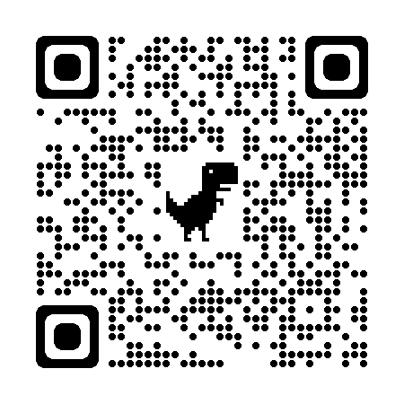
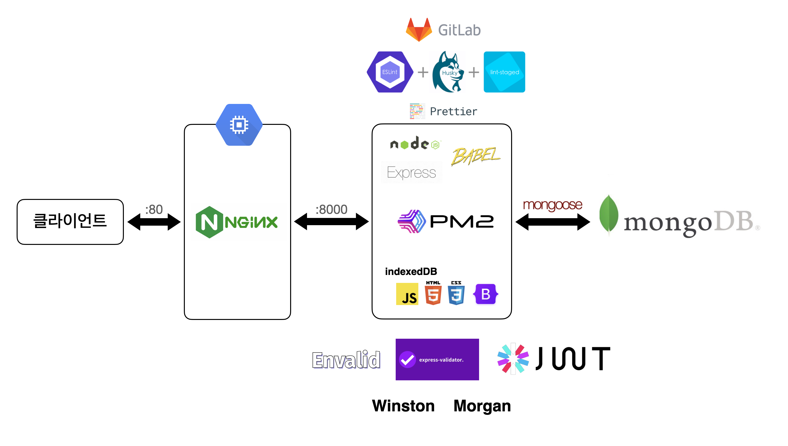

# 위판가 직거래 플랫폼 "오늘바다"

  

## **0. 팀 소개**

---

팀명: 해3물 (3팀)

팀 구성

- FE: 김우찬(팀장), 설지윤, 이예나
- BE: 김영범, 김익수

노션 페이지: https://www.notion.so/cbebef6f6b6e402ab27b7ee0bbc393a5

 

---

## **1. 서비스 소개**

 

### **1-0. 배포 링크**

  

### http://kdt-sw3-team03.elicecoding.com/

 

---

 

### **1-1. 서비스 기획**

---

#### **서비스 Version 1.0 Grand OPEN**

1. 사용자 관련 기능 구현
   > - 회원가입, 로그인, 로그아웃
   > - 마이페이지 (사용자 정보, 주문 정보, 회원 탈퇴)
2. 카테고리 및 상품 관련 기능 구현
   > - 카테고리 별 상품 리스트 조회
   > - 상품 세부 페이지
3. 장바구니, 주문 기능 구현
   > - 장바구니 추가, 수정, 삭제, 조회 등 기능 구현
   > - 장바구니 상품 주문 기능 구현
   > - 주문 후 배송 정보 수정 기능 구현
4. 관리자 페이지 기능 구현
   > - 카테고리 관리 기능
   > - 상품 관리 기능
   > - 주문 관리 기능

---

#### **서비스 장기 구현 목표 기능**

1. 공공 API를 활용한 전국 수협 위판장 공판 정보 시각화 기능

   > - 공공 오픈 API 데이터를 활용하여 하루 단위로 업데이트 (미구현)
   > - API 데이터를 차트 형태로 시각화하여 정보 제공 (미구현)
   > - 수산물 품목, 위판장, 등급, 규격, 거래금액 등 필터 제공 (미구현)
   > - 주식 거래소와 같이 직거래 매수/매도 기능 제공 (미구현)

2. 공판가 기준으로 투명한 소비자 가격 책정 방식 공개 및 시각화 (일부 구현)

   > - 상품 페이지에서 소비자 선택지 다양화 제공 (미구현)
   > - 옵션 정가제를 통한 공판가 기분 소비자가 투명화 (미구현)
   > - 대형마트 동일 상품 가격 정보에 따른 소비자 경험 제공 (미구현)

3. 수산물 종류별로 효과적인 시각화
   > - 수산물에서 확장 가능한 시스템 설계 (구현)
   > - 상숨 상세 정보는 심플하고 깔끔한 아이콘 기반으로 제공 (일부 구현)
   > - 소비자 상품 (포토)후기 기능 구현 (미구현)

 

#### **기획안 링크**

### https://www.notion.so/3821f5c24f63448e8d0c5087b6b40d0f#a87b9ff1cca54c28a88cee1c3d82ead9

 

---

### 1-2. **와이어프레임**

### https://www.figma.com/file/BR3WBFKniUGtdlR3aqyna4/OneulBada?node-id=0%3A1&t=VOLLpA4pIqA3nYSL-0

 

---

 

### 1-3. **자료 구조 설계, DB Schema**

### https://www.erdcloud.com/d/gkDc5r2oqNCWCYhLe

 

---

 

### 1-4. **API 문서**

### https://www.notion.so/a259c06258e04e859a97327466715e1a?v=d41a4abdc4554bc38816f32f3f09da57

 

---

 

## 2. 기술 스택 및 인프라 구조

  

 

- **(BE) nodeJS, express, BABEL, mongoose**

> - (validation) envalid, express-validator
> - (logger) morgan, winston
> - (authentication) JWT

- **(FE) JS, HTML, CSS, bootstrap, indexed-db**

> - daum 도로명 주소 api

- **(DB) mongoDB Atlas**

- **(DEPLOY) NginX, PM2, Google Compute Engine**

 

---

본 프로젝트에서 제공하는 모든 코드 등의는 저작권법에 의해 보호받는 ㈜오늘바다의 자산이며, 무단 사용 및 도용, 복제 및 배포를 금합니다.
Copyright (주)엘리스 SW 트랙 해3물 3팀 Inc. All rights reserved.
